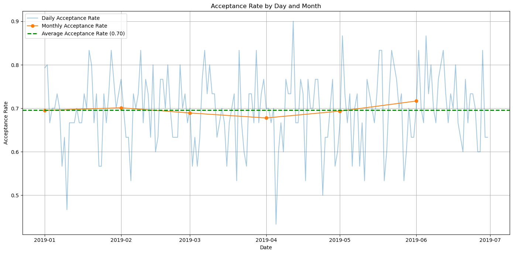
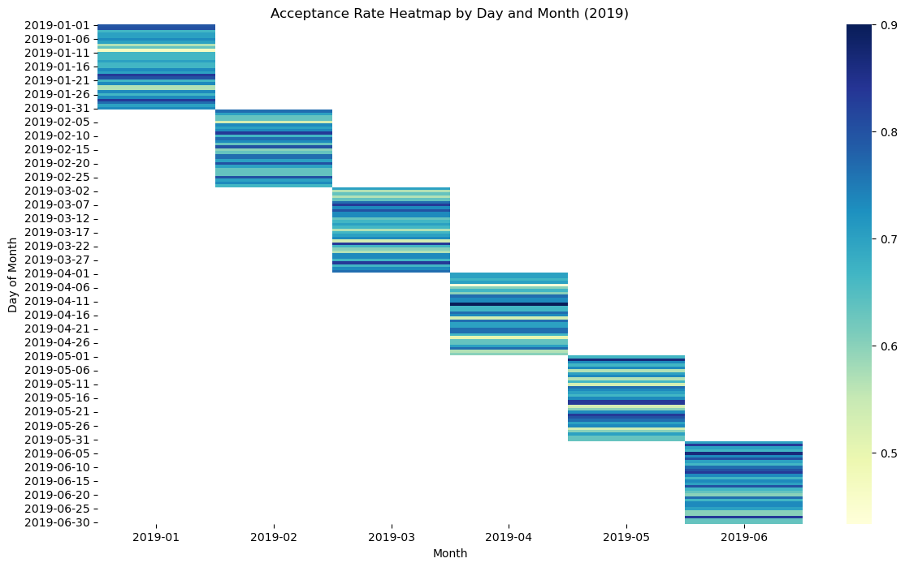
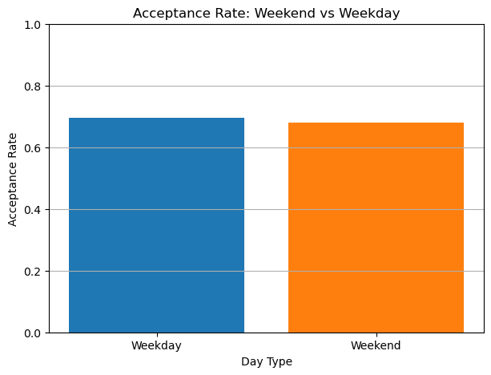
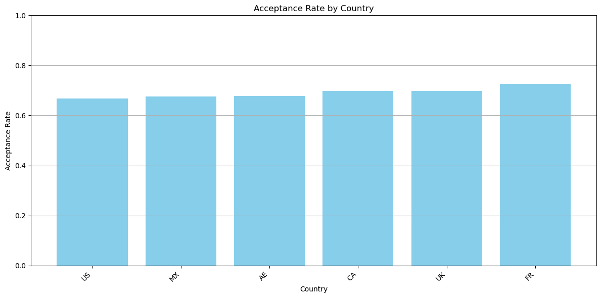
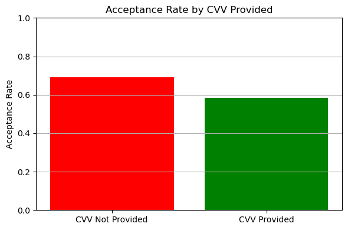
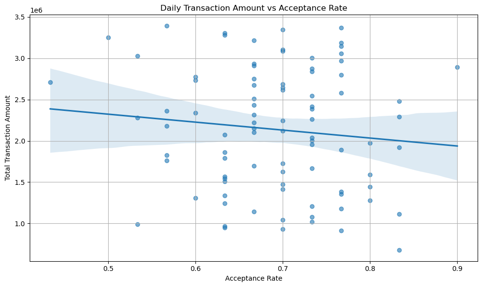

# 📊 Payment Acceptance Rate Analysis

---

## 🎯 Objective  
This project analyzes credit and debit card payment acceptance rates to identify factors influencing fluctuations and declines. The goal is to uncover potential causes behind acceptance rate changes and provide actionable insights to improve payment performance.

## 🗂️ Data and Methodology  
- Analyzed **acceptance** and **chargeback** reports, focusing on key features such as:  
  - Transaction date  
  - Country
  - Currency  
  - Transaction amount  
  - CVV provision  
- Conducted **Exploratory Data Analysis (EDA)** including:  
  - Time series analysis  
  - Acceptance rate segmentation  
  - Chargeback trend analysis  
- Focused on the critical period of declining acceptance rates: **February - April**.

## 🔍 Key Findings  

### 1️⃣ Overall Acceptance Rate  
> The average daily acceptance rate is approximately **70%**.

### 2️⃣ Time Trend Analysis  

> A significant dip in acceptance rates occurred between **February and April**, with notable daily fluctuations indicating potential instability or underlying issues.

### 3️⃣ Segmentation Analysis  

The acceptance rate was analyzed across several key segments:

- **Weekend vs. Weekday**  

> Acceptance rates remain consistent between weekends (68%) and weekdays (69%), indicating no significant day-of-week effect.  

- **Day of Week** 

> Acceptance rates are stable across all days, ranging from 66% to 74%.  

- **Country**  

> Acceptance rates vary slightly by country:  
> - US: 67%  
> - MX/AE: ~68%  
> - CA/UK: ~70%  
> - FR: 73%  

- **CVV Provided**  

> Transactions without CVV do not significantly affect acceptance rates, potentially due to tokenized or saved card transactions.  

- **Transaction Amount** 

> A slight negative correlation exists between daily acceptance rate and total transaction amount.

### 4️⃣ Chargeback Analysis  

> A spike in chargebacks preceded the acceptance rate drop, suggesting Globepay may have tightened fraud controls.  
> *Note:* Limited historical chargeback data restricts definitive conclusions.

### 5️⃣ Rate Calculations  
> Exchange rate calculations appear consistent across all transactions.

---

## 🕵️ Root Cause Hypothesis  

1. **Chargeback-Driven Controls:**  
   A surge in chargebacks likely prompted enhanced fraud prevention, increasing declines.

2. **High-Value Transaction Screening:**  
   Higher transaction amounts correlate with stricter approval rules.

---

## 📈 Conclusion  
The analysis links chargeback trends and high-value transactions to the acceptance rate decline. Additional monitoring and data are recommended to refine strategies.
