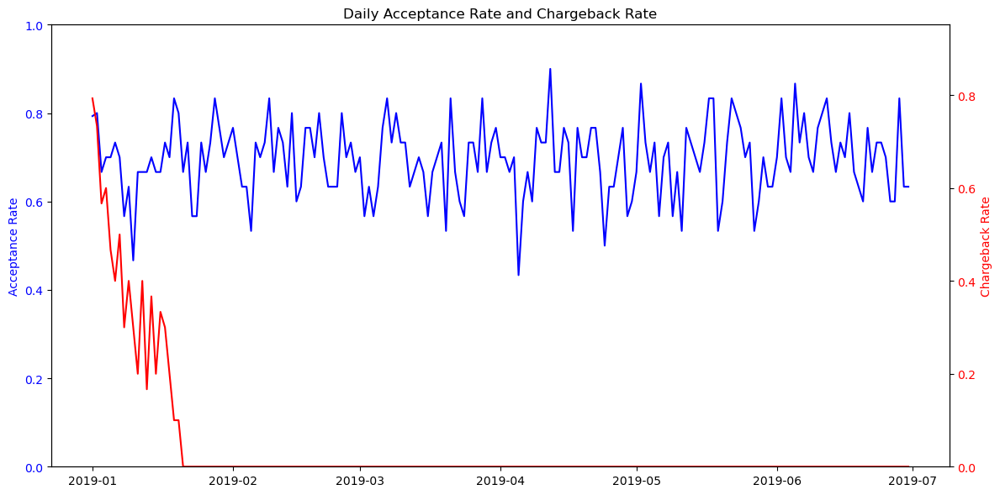

# 📊 Payment Acceptance Rate Analysis

---

## 🎯 Objective  
This project investigates the decline in **credit and debit card payment acceptance rates** processed by Globepay for Deel. The goal is to uncover potential causes behind this drop and provide actionable insights to improve payment acceptance.

## 🗂️ Data and Methodology  
- Analyzed **acceptance** and **chargeback** reports, focusing on key features such as:  
  - Transaction date  
  - Country
  - Currency  
  - Transaction amount  
  - CVV provision  
- Conducted **Exploratory Data Analysis (EDA)** including:  
  - Time series analysis  
  - Acceptance rate segmentation  
  - Chargeback trend analysis  
- Focused on the critical period of declining acceptance rates: **February - April**.

## 🔍 Key Findings  

### 1️⃣ Overall Acceptance Rate  
> The average daily acceptance rate is approximately **70%**.

### 2️⃣ Time Trend Analysis  

> A significant dip in acceptance rates occurred between **February and April**, with notable daily fluctuations indicating potential instability or underlying issues.

### 3️⃣ Segmentation Analysis  

The acceptance rate was analyzed across several key segments:

- **Weekend vs. Weekday**  

> Acceptance rates remain consistent between weekends (68%) and weekdays (69%), indicating no significant day-of-week effect.  

- **Day of Week** 

> Acceptance rates are stable across all days, ranging from 66% to 74%.  

- **Country**  

> Acceptance rates vary slightly by country:  
> - US: 67%  
> - MX/AE: ~68%  
> - CA/UK: ~70%  
> - FR: 73%  

- **CVV Provided**  

> Transactions without CVV do not significantly affect acceptance rates, potentially due to tokenized or saved card transactions.  

- **Transaction Amount** 

> A slight negative correlation exists between daily acceptance rate and total transaction amount.

### 4️⃣ Chargeback Analysis  

> A spike in chargebacks preceded the acceptance rate drop, suggesting Globepay may have tightened fraud controls.  
> *Note:* Limited historical chargeback data restricts definitive conclusions.

### 5️⃣ Rate Calculations  
> Exchange rate calculations appear consistent across all transactions.

---

## 🕵️ Root Cause Hypothesis  

1. **Chargeback-Driven Controls:**  
   A surge in chargebacks likely prompted enhanced fraud prevention, increasing declines.

2. **High-Value Transaction Screening:**  
   Higher transaction amounts correlate with stricter approval rules.

---

## 📈 Conclusion  
The analysis links chargeback trends and high-value transactions to the acceptance rate decline. Additional monitoring and data are recommended to refine strategies.
